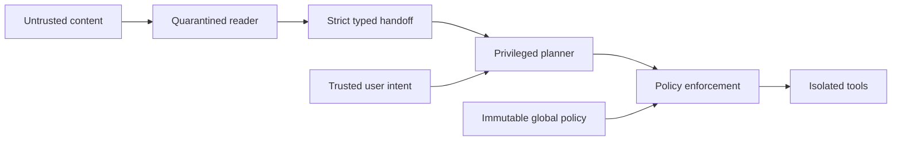

<div align="center">

# Secure-Agent-Sandbox

### Strong boundaries for agents working with untrusted content.

[](https://github.com/EthanChamps/Secure-Agent-Sandbox/actions/workflows/ci.yml)
[](pyproject.toml)
[](LICENSE)
[](#status-and-security-claim)

[Quick start](#quick-start) · [Architecture](docs/DESIGN.md) · [Deployment](docs/DEPLOYMENT.md) · [Contributing](CONTRIBUTING.md)

</div>

---

**Keep untrusted content away from privileged reasoning. Check every action outside the model. Contain every execution.**

An MIT-licensed repository template for building agents with typed handoffs, symbolic memory, deterministic authorization, and isolated execution. Python is the reference implementation; Node.js clients should call the same reference monitor over authenticated RPC rather than reimplement policy checks.

## At a glance

- **Typed handoffs:** Pydantic validates a fixed vocabulary of bounded numbers, booleans, and enums.
- **Separated reasoning:** a quarantined reader handles external text; the privileged planner receives metadata and symbolic references.
- **Deterministic authorization:** default-deny rules stay outside the model, and Z3 proves that policy updates only narrow permissions.
- **Contained execution:** a Linux gVisor adapter plus deployment contracts for Firecracker microVMs and WASI components.
- **Reviewable foundations:** regression tests, locked dependencies, CI, and an explicit threat model.



## Status and security claim

This is a runnable security reference implementation and production deployment design, **not an audited, turnkey production platform**. The local demo uses simulated LLMs and a data-only inspection tool. The gVisor adapter requires a provisioned Linux host. Firecracker, managed microVM, WASI host, TLS proxy, and remote audit deployments are integration contracts, not implemented services.

We deliberately do not claim a universal **0% prompt-injection attack success rate (ASR)**. Types eliminate freeform instruction text from one channel; they do not prove that extracted data is true, an allowed action is intended, or the implementation is vulnerability-free. A malicious integer can select the wrong record. A stolen symbolic handle can authorize an unwanted transfer if its sink is overly broad. Defined unauthorized actions are denied by the reference monitor under the assumptions in [the design](docs/DESIGN.md).

## Quick start

Install Python 3.12+ and [uv](https://docs.astral.sh/uv/getting-started/installation/), then run from this repository root:

```sh
git clone https://github.com/EthanChamps/Secure-Agent-Sandbox.git
cd Secure-Agent-Sandbox
uv sync --locked
uv run python -m secure_agent_sandbox.demo
uv run pytest -q
```

No API key, Docker, or cloud account is needed. The demo feeds hostile text to a simulated Q-Agent; the P-Agent sees only validated metadata and an opaque handle. Its result is a byte count and boolean receipt. Nothing executes the hostile text.

Expected demo output:

```json
{"byte_count":42,"accepted":true}
```

To start your own project, select **Use this template → Create a new repository** on GitHub.

For actual sandbox execution, follow [deployment guidance](docs/DEPLOYMENT.md). Do not run the Docker adapter in the LLM service: Docker daemon access is host administration authority.

## Five boundaries

| Boundary | What it enforces | What it does not establish |
| --- | --- | --- |
| MicroVM / gVisor / WASI | Restricts execution and resource access | No runtime vulnerabilities or side channels |
| Dual LLM + symbolic memory | P never receives raw external text | Semantic correctness of Q extraction |
| Typed handoff | Fixed, bounded primitive vocabulary | That a numeric selection is authorized |
| Immutable generic + shrinking task policy | Deterministic deny and solver-checked narrowing | That the global policy expresses all user intent |
| Egress broker + remote audit | Destination/operation constraints and evidence | Zero exfiltration through an allowed endpoint |

## Repository map

```text
Secure-Agent-Sandbox/
├── README.md
├── LICENSE
├── SECURITY.md
├── CONTRIBUTING.md
├── pyproject.toml
├── uv.lock
├── .github/workflows/ci.yml
├── docs/
│   ├── DESIGN.md
│   └── DEPLOYMENT.md
├── src/secure_agent_sandbox/
│   ├── agents/
│   │   ├── validator.py
│   │   └── orchestrator.py
│   ├── policies/engine.py
│   ├── sandbox/gvisor.py
│   └── demo.py
├── policies/
│   ├── generic.json
│   └── task.json
├── sandbox/
│   ├── profiles.json
│   └── wasi/tool.wit
├── proxy/contract.json
├── deploy/kubernetes/isolation.yaml
└── tests/test_security.py
```

## Threat model

An attacker controls documents, retrieved pages, tool results, generated code, and Q-Agent output. Assume they can persuade P to propose any available tool call. They must not be able to choose tenant identity, create trusted user requests, change the generic policy, issue approvals, mount host storage, access secrets, or bypass the reference monitor.

The main remaining risks are bad authorization policy, compromised trusted infrastructure, poisoned but well-typed data, misuse of legitimate tools, denial of service, dependency vulnerabilities, and leakage through permitted outputs. Context pruning is logical lifecycle management, not guaranteed deletion from provider logs or RAM. eBPF is telemetry, not a containment boundary.

## Measuring ASR honestly

Define success as a forbidden effect, not an LLM saying something suspicious. Run adaptive prompt-injection suites, cross-tenant attempts, poisoned indices, forged handles, policy expansion, network bypass, and output-flood tests alongside benign task completion. Report backend/version, policy, attack count, successful effects, and utility. Zero successes in N independent representative trials is an observation; an approximate 95% upper bound is 3/N, not proof of zero risk. This repository's unit tests are regression checks, not an empirical ASR benchmark.

## Foundations

The architecture draws on [type-directed privilege separation](https://arxiv.org/abs/2509.25926), [Progent](https://arxiv.org/abs/2504.11703), [Firecracker production guidance](https://github.com/firecracker-microvm/firecracker/blob/main/docs/prod-host-setup.md), [gVisor's security model](https://gvisor.dev/docs/architecture_guide/security/), and [Wasmtime's capability model](https://docs.wasmtime.dev/security.html). These projects are independent and do not endorse this template.
