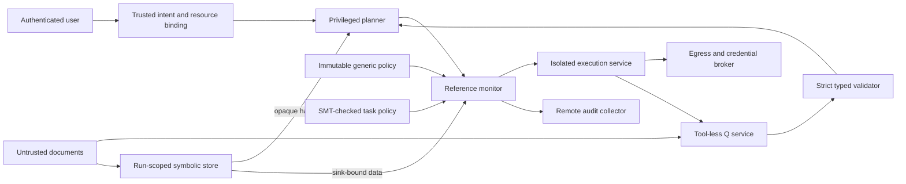

# Security architecture

## Scope and invariants

This design targets a multitenant agent execution service. The implementation demonstrates authorization and handoff semantics in one process; production must enforce the process and network boundaries below. Python private attributes are not a sandbox. Never run model-generated Python in the controller process.

1. Every tool effect is mediated by one trusted reference monitor.
2. P receives trusted user instructions, fixed metadata, opaque references, and fixed receipts only.
3. Q has no tool credentials, registry, policy-write access, or shared conversation with P.
4. The generic policy is operator-owned and immutable for a run. Task authority only decreases.
5. Handles are data references, never bearer permission to access an arbitrary sink.
6. No workload can reach the network except an explicitly authorized broker, and no workload holds upstream credentials.
7. Every sandbox has an independently enforced expiry and bounded resources.



## Identity, intent and trusted computing base

Authenticate requests at an API gateway; derive tenant and user IDs from verified identity, never model arguments. Resolve user-selected resources against tenant ownership and create a run ID, immutable intent envelope, output destinations, budgets, and policy version. A trusted user query can contain quoted external text: ingestion must classify that text as untrusted before P sees it.

The trusted computing base includes the ingestion classifier, identity service, orchestrator, validator, policy compiler/solver, tool adapters, sandbox host/VMM/runtime, broker, secret manager, approval service and audit storage. Q and P are untrusted proposers. A compromised controller can bypass this Python library; deploy adapters behind authenticated service APIs with least-privilege identities. Do not expose a generic `execute(callback)` RPC: the local callback demonstrates dispatch, while production dispatch resolves an operator-owned tool registry.

## Pillar 1: containment

**Firecracker:** use dedicated patched Linux/KVM nodes, per-VM kernels and immutable root filesystems, jailer, non-root per-instance IDs, restricted seccomp, cgroup v2, isolated network namespace/TAP, no shared host filesystem, and no host sockets. A supervisor creates a VM only after policy admission, runs a single job, collects bounded results, then destroys VM, TAP, disk overlay and tokens. A separate TTL reaper handles controller crashes. Scale-to-zero means no retained VM after the run; it is lifecycle orchestration, not a Firecracker API feature.

Treat roughly 150 ms startup as a workload-dependent target, not an end-to-end guarantee. Measure kernel boot, image preparation, provider RPC and application readiness separately. CPU quota is a rate cap; a host watchdog must also kill the entire cgroup when aggregate `cpu.stat usage_usec` exceeds its budget. VM vCPU count alone does not enforce cumulative CPU time. Fixed scratch devices bound bytes and filesystem inode limits bound small-file floods. Limit concurrent jobs, request counts and total tenant spend.

**Managed microVMs:** an E2B integration may use the provider lifecycle API only from the trusted execution service. Keep provider API keys out of guests. Require approved immutable templates, explicit network restrictions, timeout, kill in `finally`, independent expiry, and provider-side resource limits. Verify actual hardware isolation and egress enforcement for the selected product/plan. `sandbox/profiles.json` is an admission contract, not an E2B SDK wrapper. An unavailable required property denies admission. Do not silently downgrade to gVisor.

**gVisor:** the included adapter explicitly requires Docker's `runsc` runtime. Network is entirely disabled, root is read-only, user is unprivileged, capabilities are dropped, and memory, PIDs, scratch space, per-process CPU time and total wall time are bounded. Aggregate CPU is additionally bounded by CPU rate times wall duration; this is not an exact instruction budget. Logs/output are discarded to prevent floods. A production output channel needs a byte-limited reader and kill-on-overflow behavior. Only a dedicated execution worker may access Docker. Failure to remove a workload quarantines the node until the reaper confirms cleanup. gVisor reduces host syscall exposure; it does not guarantee no breakout.

**WASI components:** `sandbox/wasi/tool.wit` declares a narrow price lookup capability. The trusted host checks the compiled component's imports against an exact allowlist, creates a fresh store, sets memory/table/instance limits and fuel, and runs an independent epoch deadline. Do not inherit environment, argv secrets, filesystem preopens, sockets, or general `wasi:http`. The host resolves product indices through the same tenant policy and broker; a WIT declaration alone does not enforce permission. Bound host-call duration, concurrency and response bytes because guest fuel does not bound external I/O. The WASI host is an integration point, not implemented by this Python template.

References: [Firecracker host setup](https://github.com/firecracker-microvm/firecracker/blob/main/docs/prod-host-setup.md), [gVisor security](https://gvisor.dev/docs/architecture_guide/security/), [E2B lifecycle](https://docs.e2b.dev/sandbox), [Wasmtime security](https://docs.wasmtime.dev/security.html), [Wasmtime fuel/epoch configuration](https://docs.wasmtime.dev/api/wasmtime/struct.Config.html).

## Pillars 2 and 3: information flow

Q reads bounded raw input and emits structured candidates. JSON-mode generation is not validation. `TypeDirectedValidator` rejects extra fields, coercions, invalid enums, non-finite floats, duplicates, excessive size and malformed input. Validation errors are replaced by a fixed error: P must not see Pydantic errors containing attacker text. Field names and enum vocabulary are application-owned and never generated dynamically by Q.

The handoff permits integers, exact wire floats, booleans and fixed enum strings. Numeric channels can encode information and manipulate choices, so schema validity is separate from provenance and authorization. `file_index` is checked against trusted ingestion; production indices map to tenant-owned immutable resource IDs. Use integer minor units for money, not binary floats. Confidence is a demonstration field, never a grant of authority.

The symbolic store assigns unpredictable `$VAR_<random>` handles to immutable bytes, scoped to one run and one sink. Production records also bind tenant, user, source, classification, allowed recipients, TTL and version. P cannot mint bindings. Dereference once immediately before dispatch, revalidate semantic arguments, and authorize the resolved destination and data label. Never interpolate values into shell commands, SQL, URLs, templates or prompts. Sending an email requires independent authorization of the resolved recipient; merely possessing an email handle is insufficient.

The demonstration sink counts bytes only. It does not execute generated code or transfer data. To add execution, store code as a distinct artifact kind and authorize a dedicated sandbox-execution tool with separate policy vocabulary; do not reuse `artifact.inspect`. Host-side `eval`, `exec`, `shell=True`, dynamic module loading and arbitrary tool names are prohibited.

Tool output, exceptions, stderr, filenames and retrieved metadata return to Q or the symbolic store. P sees only validated receipts. At each step rebuild P's context from trusted intent, current policy summary, primitives and live handles. Final user output is a fixed receipt by default; raw artifacts require an authorized output channel and safe text rendering. Clear per-run memory after success and failure. Real model adapters must disable conversation reuse and enforce provider retention requirements; clearing a Python dictionary is not cryptographic erasure.

References: [typed separation research](https://arxiv.org/abs/2509.25926), [Pydantic strict mode](https://pydantic.dev/docs/validation/latest/concepts/strict_mode/).

## Pillar 4: policy semantics and proof

The JSON DSL is intentionally restricted to a closed tool vocabulary, resource sets and inclusive byte ceilings. Empty rules deny everything. A rule matches only its tool, resource and byte range. A forbid applies to its declared range, so use the full maximum to forbid all sizes. Unknown fields/tools are rejected; no eval, regex, wildcards, arbitrary predicates or policy strings reach execution.

For policy P, `allowed(P,a) = any matching allow AND NOT any matching forbid`.

Effective permission is `allowed(generic,a) AND allowed(task,a)`. Consequently task rules cannot override a generic forbid or invent a generic permission. Initial task policy is proposed from trusted intent and validated before use; its grant still intersects generic authority. An LLM-authored policy is not a replacement for deterministic user/resource authorization.

An update is accepted only if Z3 proves unsatisfiable:

```text
valid_action(a) AND allowed(candidate,a) AND NOT allowed(current_task,a)
```

This verifies task-policy subset, which is stronger than just effective-policy subset. The action universe is the same closed vocabulary and bounds used at dispatch. Unsupported DSL extensions require updating runtime and solver semantics together. A SAT result, timeout or unknown result preserves the old policy and raises `HumanAuthorizationRequired`. Authorization and dispatch use the same lock to avoid update races; distributed production uses transactional version checks and resource leases.

HITL is deliberately not an `approved=True` field. Pause dispatch, present a canonical policy diff and concrete new effects through a separate authenticated UI. Bind the signed decision to tenant/user, run, old and new policy hashes, generic version, expiry and single-use nonce. Consume it transactionally. Approval creates a **new run/authority epoch** under the unchanged generic policy; it cannot widen the existing run or override generic forbids. No approval service is included, so expansion stays blocked in the reference implementation.

References: [Progent](https://arxiv.org/abs/2504.11703), [Z3 guide](https://ericpony.github.io/z3py-tutorial/guide-examples.htm).

## Pillar 5: network, secrets and evidence

A firewall outside the workload blocks all IPv4/IPv6 outbound paths including raw sockets, DNS, UDP/QUIC, metadata services, loopback-adjacent host services and private ranges. For connected workloads, allow only the dedicated broker address and port. Environment proxy settings alone are not enforcement. Default Kubernetes policy here permits no connections at all.

Use a pinned, reviewed iron-proxy or Infisical Agent Vault deployment. `proxy/contract.json` specifies desired behavior, not vendor configuration. The broker terminates workload TLS using a private trust root and validates upstream TLS normally. Never disable certificate verification or allow arbitrary CONNECT tunnels. Keep the CA private key and secret-manager credentials outside guests. Strip incoming authorization and broker headers, validate operation scope, then inject service-specific least-privilege credentials. Drop sensitive response headers and bound/redact response bodies.

Match canonical exact hosts, ports, methods, paths and permitted query/body fields. Resolve using a trusted resolver and validate all resolved addresses on every connection to prevent DNS rebinding; reject private/link-local/metadata destinations. Disable redirects or fully reauthorize every hop. Domain allowlists alone still permit exfiltration to attacker-controlled accounts at allowed services. Bind resource ownership and payload schemas too. Proxy tokens are short-lived, service/run/workload-bound and revocable; they still carry authority inside their permitted scope.

Deploy eBPF collectors on dedicated Linux nodes for process execution, file writes/unlinks, network connections and cgroup attribution. AgentSight can complement kernel tracing with agent-level observation. Host eBPF sees VMM host syscalls, not every guest syscall; use guest telemetry for VM detail and recognize that a compromised guest can tamper with it. gVisor also changes the syscall visibility boundary. Avoid TLS plaintext capture by default because observability can expose secrets.

The monitor emits run ID, policy hash/version, tool ID, resource ID, allow/deny reason code, sandbox identity, byte counts and timestamps; never raw prompts, credentials or arbitrary error messages. Correlate host cgroup/VM identity with this record. Send events over mTLS to a separate append-only collector and retention-locked object store under a distinct administration account. Hash chains detect some tampering but do not make local logs immutable. Use signed checkpoints, clock synchronization, sequence-gap alerts and bounded buffers. Loss of mandatory audit acknowledgement denies new execution; an outbox tracks dispatched effects and recovery because a network call and an audit append are not one atomic transaction.

References: [iron-proxy](https://github.com/ironsh/iron-proxy), [Agent Vault](https://github.com/Infisical/agent-vault), [AgentSight](https://github.com/eunomia-bpf/agentsight).

## Verification and release criteria

Unit tests cover handoff rejection, tainted resource mismatch, scoped/expired handles, generic precedence, default deny, byte scopes, narrowing, forbidden-rule removal, and solver failure. They do not validate real LLM isolation or hardware/network deployment.

Before release, exercise each supported runtime with infinite loops, fork bombs, disk/inode exhaustion, output floods, OOM, raw networking, metadata probes, direct IPs, IPv6, DNS rebinding, redirect escape, stolen tokens and denied tool calls. Inject controller crashes and prove independent cleanup. Verify guest cannot reach control-plane sockets or secret stores. Test policy/update races, stale approvals, cross-tenant references, retry idempotency and audit loss. Run an adaptive injection evaluation with permitted-task utility measurements and independent security review. Pin and sign runtime images, kernels, proxy versions and deployment artifacts, generate an SBOM, scan dependencies and rehearse patch/rollback procedures.
